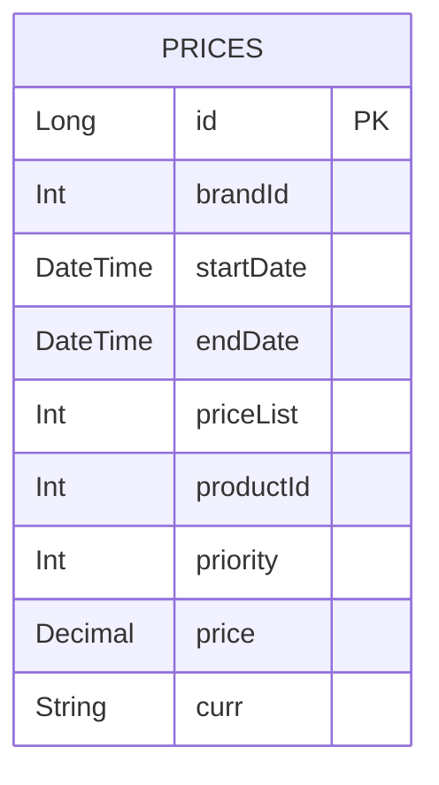

# Data Model Documentation

This document describes the data model for the `app-prices-rest` application: a single `PRICES` table holding price list entries per brand/product, with a validity window and a priority used to resolve overlaps.

## Persistence Overview

- **Database**: H2, in-memory by default (`jdbc:h2:mem:testdb`), overridable via `DATABASE_URL`/`DATABASE_USER`/`DATABASE_PASS` environment variables (see `src/main/resources/application.yaml`)
- **Schema management**: Flyway is the single source of truth. `spring.jpa.hibernate.ddl-auto` is `none` — Hibernate never creates or alters tables
- **Migrations**: `src/main/resources/db/migration/V1_create_tables.sql` (note the single-underscore separator, configured via `spring.flyway.sql-migration-separator: _`)
- **JPA mapping**: `src/main/java/com/llandaeta/prices/db/entities/PriceEntity.java`

## Model Descriptions

### PriceEntity (`test`.`PRICES`)

Represents a single price list entry: the price to charge for one product, for one brand, during one validity window, at one priority level.

**Fields:**

| Field       | Column         | Type              | Notes |
|-------------|----------------|-------------------|-------|
| `id`        | `ID`           | `IDENTITY` (Long) | Primary key, auto-generated |
| `brandId`   | `BRAND_ID`     | `INTEGER`         | Identifier of the brand/chain this price list belongs to |
| `startDate` | `START_DATE`   | `TIMESTAMP`       | Start of the validity window (inclusive) |
| `endDate`   | `END_DATE`     | `TIMESTAMP`       | End of the validity window (inclusive) |
| `priceList` | `PRICE_LIST`   | `INTEGER`         | Identifier of the price list/rate this row represents |
| `productId` | `PRODUCT_ID`   | `INTEGER`         | Identifier of the priced product |
| `priority`  | `PRIORITY`     | `INTEGER`         | Tie-breaker: when multiple rows are valid for the same brand/product/date, the highest priority wins |
| `price`     | `PRICE`        | `DECIMAL(4,2)`    | Final price. Range limited to values under 100 with up to 2 decimal places — see [Known Limitation](#known-limitation-price-precision) |
| `curr`      | `CURR`         | `VARCHAR(3)`      | ISO 4217 currency code (e.g. `EUR`) |

No column currently has a `NOT NULL`, `CHECK`, or foreign-key constraint at the database level — all validation (if any) happens implicitly via the Java types used (`int`, `double`, `LocalDateTime`, `String`).

**Relationships:**

None. `PRICES` is a single, self-contained table — there is no `Brand` or `Product` table in this schema; `brandId` and `productId` are plain integer identifiers with no referential integrity enforced by the database or the application.

### Query Access Pattern

The only query used by the application (`PriceRepository`) resolves the applicable price for a brand, product, and instant in time:

```java
Optional<PriceEntity> findFirstByBrandIdAndProductIdAndStartDateIsLessThanEqualAndEndDateGreaterThanEqualOrderByPriorityDesc(
        int brandId, int productId, LocalDateTime startDate, LocalDateTime endDate);
```

The REST controller (`PriceController`) calls this with the same `applicationDate` value passed as both `startDate` and `endDate` arguments — i.e. it finds the highest-priority row whose window (`START_DATE <= applicationDate <= END_DATE`) contains that single instant.

### Seed Data

The Flyway migration also seeds four overlapping price rows for `brandId=1`, `productId=35455`, exercised directly by `PriceControllerTest`:

| priceList | startDate           | endDate             | priority | price | curr |
|-----------|---------------------|----------------------|----------|-------|------|
| 1         | 2020-06-14 00:00:00 | 2020-12-31 23:59:59 | 0        | 35.50 | EUR  |
| 2         | 2020-06-14 15:00:00 | 2020-06-14 18:30:00 | 1        | 25.45 | EUR  |
| 3         | 2020-06-15 00:00:00 | 2020-06-15 11:00:00 | 1        | 30.50 | EUR  |
| 4         | 2020-06-16 00:00:00 | 2020-12-31 23:59:59 | 1        | 38.95 | EUR  |

Controller tests treat this seed data as the fixture — new controller-level tests should either query against these existing rows or add new seed rows via a new migration (see `docs/backend-standards.md#flyway-migrations`).

## Entity Relationship Diagram



There is only one entity; no relationships to diagram.

## Known Limitation: Price Precision

`PRICE` is `DECIMAL(4,2)`, so the maximum representable value is `99.99`. Any future price data reaching or exceeding 100, or requiring more than 2 decimal places, will fail to persist and requires a new Flyway migration to widen the column (e.g. `DECIMAL(8,2)`) — this is an existing limitation of the current schema, not a rule to design new features around.

## Notes

- Identifiers (`brandId`, `productId`) are plain integers with no lookup table; if brand/product master data is introduced later, this document and the migration history must be updated together, and this note removed.
- The Flyway migration hardcodes the schema name `test` (`CREATE SCHEMA test;`) and quotes identifiers with backticks (MySQL-style), which H2 accepts; this must stay in sync with `spring.flyway.schemas: test` in `application.yaml` and with `@Table(schema = "test")` on `PriceEntity`.
- No soft-delete, audit columns (`createdAt`/`updatedAt`), or versioning columns exist on `PRICES`.
