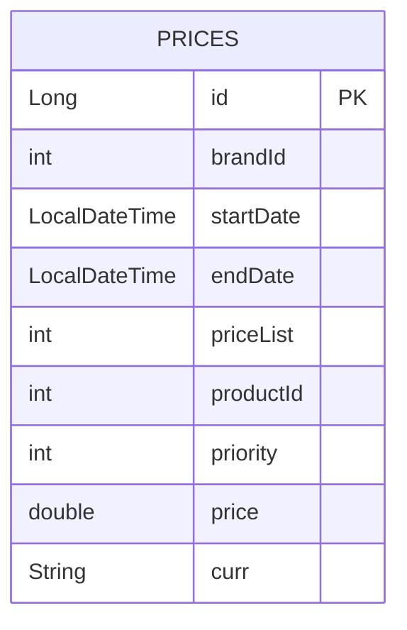

# Data Model Documentation

This document describes the data model for the `app-prices-rest` application: a single table,
`PRICES`, that stores time-bounded, prioritized price rules for a (brand, product) pair.

## Model Descriptions

### 1. Price

Represents a price rule applicable to a product for a given brand during a specific date range,
at a given priority.

**Table**: `test.PRICES` (schema `test`, created by Flyway migration `V1_create_tables.sql`)

**Fields** (`db.entities.PriceEntity`, mapped 1:1 to columns):
- `id` (`ID`): `Long`, identity primary key
- `brandId` (`BRAND_ID`): `int` — identifies the brand this price rule belongs to
- `startDate` (`START_DATE`): `LocalDateTime` — inclusive start of the rule's applicability window
- `endDate` (`END_DATE`): `LocalDateTime` — inclusive end of the rule's applicability window
- `priceList` (`PRICE_LIST`): `int` — identifier of the price list/tariff this row belongs to (a
  business identifier, not a foreign key to another table in this codebase)
- `productId` (`PRODUCT_ID`): `int` — identifies the product this price rule applies to
- `priority` (`PRIORITY`): `int` — used to pick a single winner when multiple rules overlap for
  the same brand/product/date; higher priority wins (see Business Rule below)
- `price` (`PRICE`): `double`, column type `DECIMAL(4,2)` — the price amount
- `curr` (`CURR`): `String`, `VARCHAR(3)` — currency code (e.g. `EUR`)

**Validation Rules**: none are currently enforced at the entity, repository, or controller level —
there are no Bean Validation annotations and no request-body validation (the only inputs are the
three `@RequestParam`s parsed by `PriceController`). This is documented as the current state, not
a target to preserve if input validation is added later.

**Relationships**: none. `PRICES` is a single, self-contained table; there is no foreign key to
any other table in this codebase.

## Business Rule — Price Resolution

Given `brandId`, `productId`, and a point in time (`applicationDate`, used as both the range-check
start and end in the current query — see `PriceServiceImpl.searchPriceToApply` and
`PriceController`), the applicable price is the row where:
- `BRAND_ID` matches,
- `PRODUCT_ID` matches,
- `START_DATE <= applicationDate <= END_DATE`,

with the **highest `PRIORITY`** among all matching rows (`PriceRepository`'s derived query name
ends in `OrderByPriorityDesc`, and the service takes the first result). If no row matches,
`NoPriceFoundException` (HTTP 404) is thrown.

## Entity Relationship Diagram

No relationships to diagram — this is a single-table model.

## Seed Data

`V1_create_tables.sql` inserts 4 rows, all for `brandId=1`, `productId=35455`, exercising
overlapping-date-range and priority-tiebreak scenarios (these rows are also the fixture basis for
`PriceControllerTest`'s 5 test cases). Treat these rows as fixture data for the H2 in-memory
database, not as production reference data.

## Notes

- `hibernate.ddl-auto: none` — this document, not Hibernate, describes the schema; the migration
  file (`src/main/resources/db/migration/V1_create_tables.sql`) is the actual source of truth.
- The `PRICE_LIST` column is a plain integer business identifier; there is no `PriceList`
  entity/table in this codebase to relate it to.
